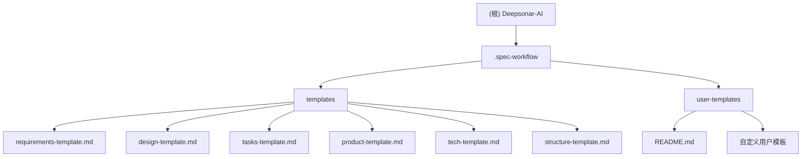

# Deepsonar-AI 项目架构文档

## 项目愿景

Deepsonar-AI 是一个软件开发规范工作流模板系统，旨在为开发团队提供标准化的项目文档模板和最佳实践指导。通过提供结构化的文档模板，帮助团队建立一致的开发流程，提高项目质量和协作效率。

## 架构总览

本项目采用模板驱动的架构设计，主要包含以下核心组件：

- **文档模板系统**：提供标准化的项目文档模板
- **用户自定义模板**：支持项目特定的模板定制
- **工作流集成**：与开发工作流无缝集成

### 技术栈
- **主要格式**：Markdown 文档模板
- **扩展性**：支持用户自定义模板覆盖
- **版本管理**：基于 Git 的模板版本控制

## ✨ 模块结构图

## 模块索引

| 模块路径 | 模块类型 | 主要职责 | 状态 |
|---------|---------|---------|------|
| `.spec-workflow/templates` | 核心模板系统 | 提供标准化的项目文档模板 | ✅ 完整 |
| `.spec-workflow/user-templates` | 用户扩展系统 | 支持项目特定的模板定制 | ✅ 完整 |

### 核心模板清单

| 模板文件 | 用途 | 适用阶段 |
|---------|------|---------|
| `requirements-template.md` | 需求文档模板 | 项目需求分析 |
| `design-template.md` | 设计文档模板 | 技术设计阶段 |
| `tasks-template.md` | 任务分解模板 | 开发规划阶段 |
| `product-template.md` | 产品概述模板 | 产品规划阶段 |
| `tech-template.md` | 技术栈模板 | 技术选型阶段 |
| `structure-template.md` | 项目结构模板 | 架构设计阶段 |

## 运行与开发

### 开发环境
- **工具依赖**：无外部依赖，纯 Markdown 文档
- **编辑器**：支持 Markdown 的任意编辑器
- **版本控制**：Git

### 使用流程
1. **模板选择**：根据项目需求选择合适的模板
2. **内容填充**：按照模板结构填写项目具体信息
3. **自定义扩展**：在 `user-templates` 目录创建项目特定模板
4. **版本管理**：通过 Git 管理模板版本和变更

## 测试策略

### 模板验证
- **结构完整性**：确保模板包含所有必要的章节
- **格式一致性**：验证 Markdown 格式和样式规范
- **内容指导性**：确保模板提供足够的填写指导

### 用户反馈
- **易用性测试**：收集用户使用体验反馈
- **实用性评估**：评估模板在实际项目中的适用性
- **持续改进**：根据反馈持续优化模板内容

## 编码规范

### 文档规范
- **Markdown 语法**：遵循标准 Markdown 语法规范
- **章节结构**：使用一致的标题层级（H1-H4）
- **代码示例**：提供语言特定的代码示例
- **占位符**：使用方括号 `[]` 标记需要填写的内容

### 模板变量
- **项目名称**：`{{projectName}}`
- **功能名称**：`{{featureName}}`
- **当前日期**：`{{date}}`
- **文档作者**：`{{author}}`

## AI 使用指引

### 模板生成
- **内容建议**：基于项目类型推荐合适的模板组合
- **字段填充**：协助用户填写模板中的技术细节
- **最佳实践**：提供特定技术栈的最佳实践建议

### 文档优化
- **结构审查**：检查文档结构的完整性和逻辑性
- **内容质量**：提升描述的准确性和清晰度
- **格式规范**：确保文档符合项目标准

## 变更记录 (Changelog)

### 2025-12-09 - 初始架构分析
- 完成项目全仓清点和模块识别
- 创建根级 CLAUDE.md 架构文档
- 建立 Mermaid 模块结构图
- 完成模板系统的完整分析

---

*本文档由 AI 架构师自动生成，基于 2025-12-09 08:49:52 的项目状态分析*